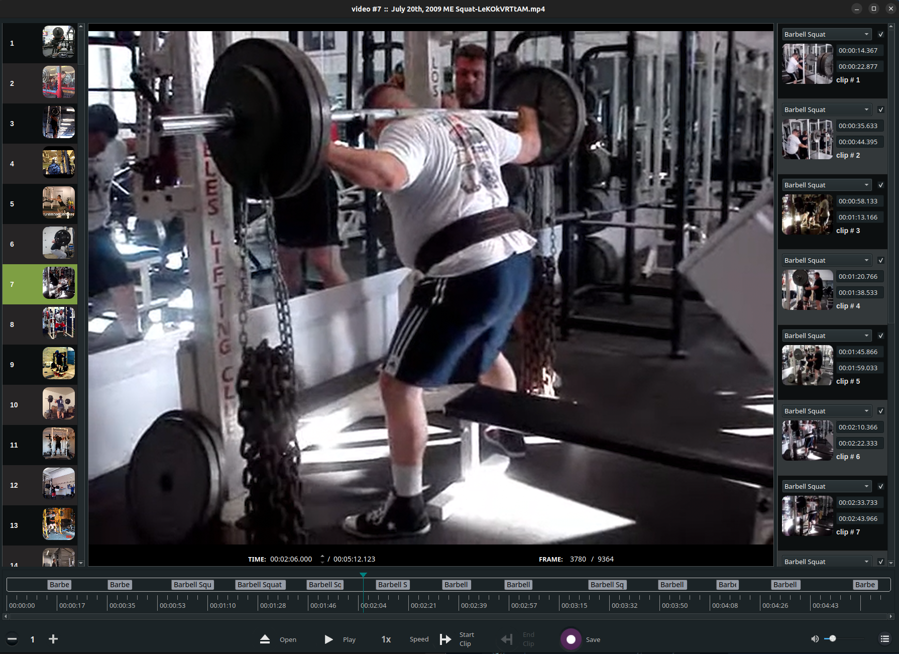

### Running from Python source

In order to run from source code you need to first build a Python extension and then run the app as follows, from within the source code folder:

```
$ python3 setup.py build_ext -i
$ python3 -m vidcutter
```

Working installations of **libmpv** and **ffmpeg** must be pre-installed for your specific OS. For Linux, package names are usually named **libmpv1** or **mpv** and **ffmpeg**. For the media information option to work you'll also need a working install of **mediainfo**.

You will need Python packages **pyopengl** and **simplejson** pre-installed, via **pip install pyopengl simplejson** or distro packages, and a working PyQt5 + Qt5 libraries installation. Windows users can simply **pip install PyQt5** to be up and running, Linux users should install a relevant PyQt5 package from their Linux distribution's package manager. Linux package names for PyQt5 are usually named **python-pyqt5** or **python3-pyqt5** and will take care of the Qt5 side of things too.

***

## Command-line for debugging (Linux/macOS only)

```
$ vidcutter --help

Usage: vidcutter [options] [video] [project]

VidCutter - the simplest + fastest video cutter & joiner

Options:
  --debug        debug mode; verbose console output & logging. This will
                 basically output what is being logged to file to the console
                 stdout. Mainly useful for debugging problems with your system
                 video and/or audio stack and codec configuration.
  --dev          developer mode; disables the use of compiled resource files so
                 that all app resources & assets are accessed directly from the
                 file system allowing you to see UI changes immediately. this
                 typically relates to changes made to Qt stylesheets (.qss),
                 layout/templates, content includes and images. basically all
                 assets defined in .qrc files throughout the codebase.
  -v, --version  Displays version information.
  -h, --help     Displays this help.

Arguments:
  video          Preload video file
  project        Open VidCutter project file (.vcp)
```
